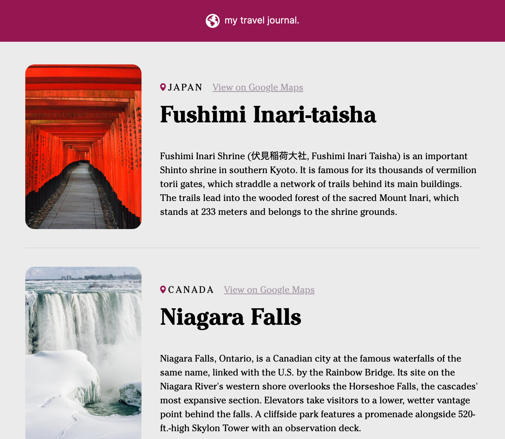

# Travel Journal




This is the second module's solo project of Scrimba's [Learn React for free](https://scrimba.com/learn/learnreact) course.


## Requirements
- Data array in seperate .js file
  - Title
  - Location
  - Google Maps link
  - Start date
  - End date
  - Description
  - Image URL
- use `.map()` and props
- Styled and polished ([Figma design reference](https://www.figma.com/file/QG4cOExkdbIbhSfWJhs2gs/Travel-Journal))

---


## Run in development mode
```
npm start
```

## Build for production
```
npm run build
```

This project was bootstrapped with [Create React App](https://github.com/facebook/create-react-app)